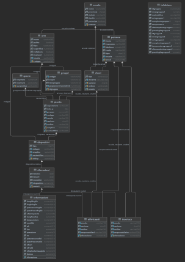

# Progettazione Basi di Dati — Sistema di Biomonitoraggio Scolastico

Progetto accademico (corso di Basi di Dati) di progettazione completa di una base di dati
PostgreSQL, dalla modellazione concettuale alla messa a punto fisica con analisi dei piani
di esecuzione, fino alla definizione di una politica di controllo degli accessi basata su ruoli.

## Obiettivo

Un ente scolastico coordina un progetto di citizen science in cui scuole, classi e singoli
partecipanti monitorano la crescita di piante in "orti" didattici, raccogliendo rilevazioni
ambientali manuali o automatiche (da sensori/dispositivi IoT) per confrontare gruppi di
controllo e gruppi di monitoraggio. Il progetto copre l'intero ciclo di progettazione di una
base di dati relazionale a supporto di questo caso d'uso.

## Cosa dimostra questo progetto

- Modellazione concettuale: diagramma Entità-Relazione con gerarchie di generalizzazione,
  vincoli d'integrità complessi (25 vincoli tra CHECK e TRIGGER) e relazioni n-arie.
- Progettazione logica: traduzione in schema relazionale e verifica formale della qualità
  dello schema tramite analisi delle dipendenze funzionali (tutte le relazioni in BCNF).
- Progettazione fisica su PostgreSQL: scelta motivata di indici (hash, ordinati,
  clusterizzati/non) sulla base dei piani di esecuzione reali (`EXPLAIN`), con misurazione
  dei tempi di accesso prima/dopo l'introduzione degli indici.
- Sicurezza e controllo degli accessi: definizione di una gerarchia di ruoli
  (gestore di progetto → referente di scuola → insegnante → studente) con privilegi
  SQL differenziati per tabella e operazione (SELECT/INSERT/UPDATE/DELETE).

## Struttura del repository

- `ParteI.pdf` — analisi dei requisiti, modello ER, schema logico e verifica BCNF
- `ParteII.sql` / `ParteII_popolamento.sql` — DDL dello schema fisico e script di popolamento
- `ParteIII.pdf` — query di workload, scelta degli indici, piani di esecuzione, RBAC
- `ParteIII.sql` — script di creazione indici, ruoli e privilegi
- `DiagrammaDataGrip.pdf` — diagramma ER dello schema fisico realizzato in DataGrip

## Stack tecnico

PostgreSQL · SQL (DDL/DML, trigger, funzioni) · DataGrip (progettazione e reverse engineering)

## Esempio: ottimizzazione di una query

La query sulle rilevazioni per data passa da una scansione sequenziale (0,116 ms) a un
accesso tramite indice hash (0,026 ms) dopo l'introduzione di `CREATE INDEX idxRil ON
Rilevazioni USING HASH (timeRil)`, scelto rispetto a un indice ordinato perché la relazione
è soggetta a inserimenti frequenti e non richiede ricerche per intervallo su quell'attributo.

